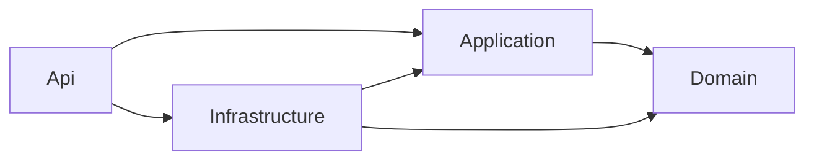

# ADR 0001 — Arquitetura hexagonal enxuta

Status: adotada como contrato inicial de implementação. Relacionada a #1, #2 e #4.

## Contexto

Os três templates anteriores repetem uma estrutura de 22 projetos. O CLI gera código
para essa estrutura, inclusive repasses entre ApplicationService, MediatR, AutoMapper,
DomainService e Repository. As IDEs também assumem seus caminhos. Por isso a mudança
é coordenada com um manifesto versionado e um gerador legado, não apenas com renomes.

## Decisão

Toda aplicação nova contém quatro projetos de produção:

| Projeto | Responsabilidade | Referências permitidas entre projetos |
| --- | --- | --- |
| `MinhaApi.Domain` | Entidades, invariantes e regras de negócio | Nenhuma |
| `MinhaApi.Application` | Casos de uso, DTOs e portas de saída | Domain |
| `MinhaApi.Infrastructure` | Implementação de persistência e integrações | Application e Domain |
| `MinhaApi.Api` | Adaptador HTTP e composição das dependências | Application e Infrastructure |



As setas indicam referências de compilação. A referência Api → Infrastructure é usada
na composição das dependências; controllers não acessam DbContext, drivers ou repositórios
concretos. Domain e Application usam apenas a biblioteca padrão do .NET no template básico.
Uma classe concreta de caso de uso é uma porta de entrada suficiente; não se exige uma
interface para cada classe.

Exemplo de saída para PostgreSQL:

```text
MinhaApi.sln
.openbase.json
Directory.Packages.props
src/
  MinhaApi.Domain/
    Customers/
  MinhaApi.Application/
    Customers/
    Ports/
  MinhaApi.Infrastructure/
    Persistence/
      Postgres/
        Migrations/
  MinhaApi.Api/
    Controllers/
tests/
  MinhaApi.Tests.Unit/
  MinhaApi.Tests.Integration/
```

Testes não entram na contagem dos quatro projetos de produção. `.sln` é o padrão de
geração inicial; a descoberta também aceita `.slnx` quando explicitamente indicada no manifesto.

## Casos de uso e portas

- O exemplo Customer cobre criar, obter e listar com paginação; o scaffold também
  gera atualização e remoção pelo mesmo padrão.
- Casos de uso são explícitos e organizados por funcionalidade, sem DomainService
  genérico de repasse ou repositório genérico como contrato público obrigatório.
- As portas ficam em Application e representam necessidades concretas. Elas não
  expõem SQL, IQueryable, Expression de consultas, DbContext ou tipos de drivers.
- DTOs e conversões simples são explícitos. MediatR e AutoMapper não são dependências
  obrigatórias; os geradores novos não produzem IRequest, handlers ou profiles dessas
  bibliotecas. O gerador legado continua preservando o modelo antigo.
- Invariantes ficam em Domain. Validação de entrada/paginação fica em Application.
  A API converte falhas conhecidas para ProblemDetails: criação 201, ausência 404,
  validação de negócio/entrada 422. JSON inválido/model binding pode continuar retornando 400.
- Cancelamento atravessa todos os limites assíncronos. A API não transforma cancelamento
  solicitado pelo cliente em falha interna 500.

## Persistência

O template fonte mantém implementações dos três bancos. O mecanismo de geração exclui
os outros dois adaptadores, seus pacotes e suas migrations. Não haverá um switch de
provider em cada consulta nem seleção dinâmica de banco em produção no template básico.

EF Core cuida do mapeamento, escrita e migrations. Dapper é usado em consultas em que
SQL explícito agrega valor; não duplicamos toda consulta automaticamente. Ambos ficam
na Infrastructure e podem compartilhar a mesma conexão e transação scoped.

O contrato transacional preferido é uma porta `IUnitOfWork.ExecuteAsync`, que executa
uma operação de aplicação, salva alterações pendentes e confirma ou desfaz a unidade.
Os repositórios não confirmam mudanças individualmente. O adaptador:

1. Abre a conexão sob demanda e impede transações aninhadas no mesmo escopo.
2. Compartilha a transação entre EF e Dapper.
3. Confirma somente após o sucesso da operação e do SaveChanges.
4. Faz rollback/descarte em falha ou cancelamento, preservando a exceção original
   se a limpeza também falhar; limpa estado de rastreamento incompatível.
5. Não repete cegamente escritas ou comandos isolados de uma transação abortada.

Migrations têm lifecycle próprio e conjunto separado por provider. SQL, binding,
conversões de tipos, schemas e políticas de falhas ficam no adaptador. Trocar o valor
`database` do manifesto não converte uma aplicação existente ou seus dados.

## Dependências e extensões

- Versões de pacotes são centralizadas e estáveis, compatíveis com o SDK definido.
- Composição e registros de DI são explícitos e idempotentes; não dependem de procurar
  interfaces por strings de namespace. O scaffold atualiza pontos de registro definidos.
- Logs estruturados são configurados uma vez no host. A base usa logging do .NET;
  bibliotecas adicionais precisam de uso real e justificativa.
- JWT, Redis, MongoDB, health checks e domain events são recursos opcionais. O CLI
  anuncia compatibilidade por arquitetura; recurso não portado retorna indisponibilidade,
  em vez de gravar código do layout antigo na solução nova.
- Não haverá projetos vazios de Cloud, Common ou um projeto por biblioteca.

## Compatibilidade e consequências

O manifesto v2 identifica a arquitetura nova. Manifestos anteriores e soluções sem
manifesto são classificados por uma estratégia de descoberta legada, somente de leitura.
O CLI não altera o layout antigo automaticamente. Detecção ambígua ou versão desconhecida
interrompe a operação com um erro acionável.

A mudança requer revisão dos geradores `scaffold`, `specialist`, `procedure`, extensões
opcionais, descoberta e migrations. O template novo não será apresentado como compatível
com o CLI antigo. As IDEs negociam capacidades e versões pelo protocolo definido.

## Critérios de conformidade

Os testes futuros devem verificar referências entre projetos e tipos públicos das portas;
comportamento de casos de uso com adaptadores de teste; DI da API; ausência de pacotes de
outros bancos no projeto gerado; transações/cancelamento em servidores reais. O mesmo
contrato funcional deve passar nos três providers.

Essa decisão substitui a proposta inicial de reaproveitar as interfaces CRUD do protótipo.
Protótipos locais e os testes da estrutura anterior são evidência de comportamentos,
não uma implementação concluída desta arquitetura.
